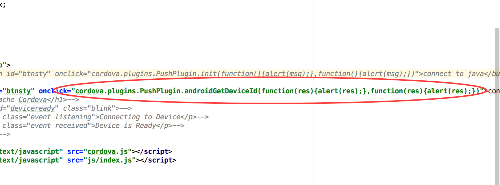
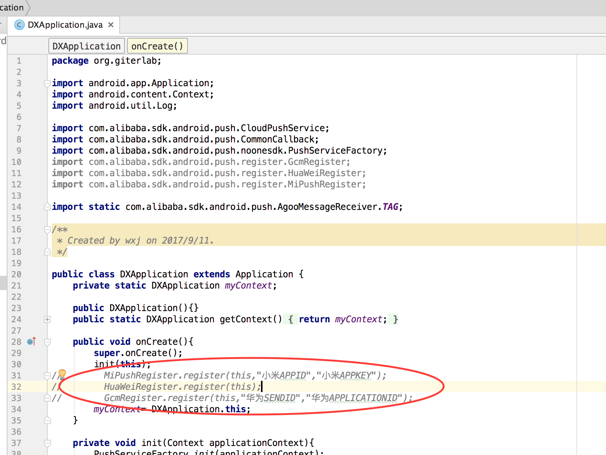

# cordova-plugin-acmp
aliyun acmp for cordova 
如果你发现有bug,fork之后提交就行了 
钉钉：wxj109

已经上传npm 可直接安装 
cordova plugin add cordova-plugin-acmp --nofetch --force --variable ANDROID_APP_KEY=*** --variable ANDROID_APP_SECRET=*** --variable IOS_APP_KEY=*** --variable IOS_APP_SECRET=***

## 本插件的作用
### cordova-plugin-acmp的主要作用是为了把阿里云移动推送集成到cordova开发中去

## 插件的使用
# 1.cordova开发环境
### cordova安装请参考[cordova安装教程](http://cordova.axuer.com)

# 2.使用步骤

如上图所示，从本地址git clone 项目到本地，也可以直接线上安装
### <del>cordova plugin add \<path\> --nofetch --force --variable APP_KEY=*** --variable APP_SECRET=***
由于阿里云移动推送的改版，现在Android和iOS的appid和appsercret分离，所以安装命令修改如下： 
### cordova plugin add \<path\> --nofetch --force --variable ANDROID_APP_KEY=*** --variable ANDROID_APP_SECRET=*** --variable IOS_APP_KEY=*** --variable IOS_APP_SECRET=***
使用cordova add plugin命令把plugin安装到项目中。 
PS:因为本项目对安卓的mainfest.xml文件作了修改，--force为了重写mainfest.xml文件，避免引起冲突，如有需要可在插件安装成功之后把需要自行添加到mainfest文件中。
### cordova plugin ls
使用此命令查看插件装成功与否，如果出现org.giter.pushplugin则表明插件安装成功

# 3.js的调用

 
如上图所示，在项目家在cordova.js的情况先，直接使用cordova.plugins.PushPlugin.androidInit(success,fail)调用 
由于plugin已经安装到项目中去，所以也可以通过window.cordova.plugins.PushPlugin.funcName(success(res),fail(res))全局调用

# 4.js接口说明

## android接口([具体可参考](https://help.aliyun.com/document_detail/30066.html?spm=5176.doc51056.6.620.R8qiaA))

### <del>1.androidInit(success,fail)</del>
 <del>android系统初始化阿里云推送调用接口，success,fail分别为成功和失败的回调函数</del>
，随着程序的启动自动初始化，取消了本接口
### <del>2.androidBand(success,fail,args)
 <del>android绑定信息调用接口，success,fail为成功和失败的回调函数
#### <del>args格式
 <del>args为参数数组，args[0]表示需要绑定的账号信息，args[1]为需要给账号添加的tags（标签）和alias（别名）组合成json各式数据
例如：**["giterlab","{\"tag_key\":1,\"tag_value\":[\"giter\",\"lab\"],\"alias":\"labgiter\"}"]**

 <del>tag_key 目标类型，1：本设备；2：本设备绑定账号；3：别名

 <del>tag_value 标签（数组输入）

 <del>alias 别名（仅当tag_key = 3时生效）

 <del>tag_key 目标类型，1：本设备；2：本设备绑定账号；3：别名

 <del>tag_value 标签（数组输入）

 <del>其中tag_key,tag_value,alias为json的key，不能更改！！
 
### 3.androidBindAccount(success(res),fail(res),args)
android系统绑定账号信息接口，其中args为参数数组，只接受一个参数，格式：
["gitlab"]

### 4.androidBindTagsandAlias(success(res),fail(res),args)
android系统绑定标签别名信息，其中args为参数数组，只接受一个参数，格式：
**["{\"tag_key\":1,\"tag_value\":[\"giter\",\"lab\"],\"alias":\"labgiter\"}"]**

 tag_key 目标类型，1：本设备；2：本设备绑定账号；3：别名

 tag_value 标签（数组输入）

 alias 别名（仅当tag_key = 3时生效）

 tag_key 目标类型，1：本设备；2：本设备绑定账号；3：别名

 tag_value 标签（数组输入）
 
### 5.androidUnBindAccount(success(res),fail(res))
android系统解绑账号接口

### 6.androidUnBindTagsandAlias(success(res),fail(res))
android系统解绑标签和别名接口，其中args为参数数组，只接受一个参数，格式同绑定标签和别名参数
### 7.androidGetDeviceId(success(res),fail(res))
android系统获取设备ID接口，结果在回调函数中以参数形式返回

### 8.androidListTags(success(res),fail(res),args)
android系统获取标签接口，其中args为参数数组，只接受一个参数，格式：
**[\"{\"tag_key\":1}\"]**
### 9.androidListAlias(success(res),fail(res))
android获取别名接口，结果在回调函数的参数中返回

### 10.androidRemoveAlias(success(res),fail(res),args)
android移除别名接口,其中args为参数数组，只接受一个参数，格式：
["gitlab"]
### 11.androidSetNotificationSoundFilePath(success(res),fail(res),args)
android设置通知声音接口接口,其中args为参数数组，只接受一个参数，格式：
["R.raw.alicloud_notification_sound"]
### 12.androidSetNotificationLargeIcon(success(res),fail(res),args)
android设置通知栏图标接口,其中args为参数数组，只接受一个参数，格式：
["R.drawable.alicloud_notification_largelcon"]
### 13.androidSetNotificationSmallIcon(success(res),fail(res),args)
android设置通知栏图标接口,其中args为参数数组，只接受一个参数，格式：
[1]
### 14.androidSetDoNotDisturb(success(res),fail(res),args)
android设置免打扰时间段接口,其中args为参数数组，只接受一个参数，格式：
[13，47，15，50]
其中args[0]为开始的小时，args[1]为开始的分钟,args[2]为结束的小时,args[3]为结束的分钟
### 15.androidSetCloseDoNotturbMode(success(res),fail(res))
android关闭免打扰接口
### 16.androidSetClearNotifications(success(res),fail(res))
android删除免打扰接口
### 17.androidBindPhoneNumber(success(res),fail(res),args)
android设置通知手机短信提醒的接口（仅限于使用了阿里云短信推送的开发者）,args为参数数组，只接受一个参数，格式：
["1313***8503"]
### 18.androidUnBindPhoneNum(success(res),fail(res))
android解绑手机短信通知接口

### 19.androidOnMessageRes(success(res),fail(res))
android接受消息通道接口，结果以回调参数形式返回，（数据格式与iOS不同）
### 20.androidOnNotifyClick(success(res),fail(res))
android处理用户点击通知回调，结果以回调参数形式返回，（数据格式与iOS不同）
## iOS接口([具体可参考](https://help.aliyun.com/document_detail/42668.html?spm=5176.doc30066.6.626.JxmZqE))
### 1.iosInit(successs(res),fail(res))
 iOS系统初始化阿里云推送调用接口，success,fail分别为成功和失败的回调函数

### <del>2.iosBand(success,fail,args)

<del>iOS绑定信息调用接口，同上androidBand
### 3.iosBindAccount(success(res),fail(res),args)
iOS系统绑定账号信息接口，其中args为参数数组，只接受一个参数，格式：
["gitlab"]

### 4.iosBindTagsandAlias(success(res),fail(res),args)
iOS系统绑定标签别名信息，其中args为参数数组，只接受一个参数，格式：
**["{\"tag_key\":1,\"tag_value\":[\"giter\",\"lab\"],\"alias":\"labgiter\"}"]**

 tag_key 目标类型，1：本设备；2：本设备绑定账号；3：别名

 tag_value 标签（数组输入）

 alias 别名（仅当tag_key = 3时生效）

 tag_key 目标类型，1：本设备；2：本设备绑定账号；3：别名

 tag_value 标签（数组输入）
 
### 5.iosUnBindAccount(success(),fail(res))
iOS系统解绑账号接口

### 6.iosUnBindTagsandAlias(success(res),fail(res))
iOS系统解绑标签和别名接口，其中args为参数数组，只接受一个参数，格式同绑定标签和别名参数
### 7.iosGetDeviceId(success(res),fail(res))
iOS系统获取设备ID接口，结果在回调函数中以参数形式返回

### 8.iosListTags(success(res),fail(res),args)
iOS系统获取标签接口，其中args为参数数组，只接受一个参数，格式：
**[\"{\"tag_key\":1}\"]**
### 9.iosListAlias(success(res),fail(res))
iOS获取别名接口，结果在回调函数的参数中返回

### 10.iosRemoveAlias(success(res),fail(res),args)
iOS移除别名接口,其中args为参数数组，只接受一个参数，格式：
["gitlab"]

### 11.iosOnMessageRes(success(res),fail(res))
iOS接受消息通道，结果以回调参数形式返回，（数据格式与android不同）

### 12.iosOnNotificationClick(success(res),fail(res))
iOS处理用户点击通知回调，（数据格式与android不同）

# 5.iOS部分项目配置

 
如上图所示在项目TARGETS中在capabilities中打开Push Notifications

 
如上图所示在项目Build Setting中，Other Linker Flags加上-ObjC标签

# 6.小米华为辅助通道配置

上图中在init(this)；方法下面打开注释的三行即打开了小米华为的辅助推送通道，关于小米、华为开发者账号的注册请参照：
[移动辅助通道配置](https://help.aliyun.com/document_detail/30067.html?spm=5176.doc30064.6.621.uWVKlw) 
小米开发者账号注册：[小米开放平台](https://dev.mi.com/console/) 
华为开发者账号注册：[华为开发者联盟](http://developer.huawei.com/consumer/cn/?spm=5176.doc30067.2.14.rPh7O7) 
FCM推送平台注册：[FCM推送平台](https://console.firebase.google.com/?spm=5176.doc30067.2.15.fEbcKU) 