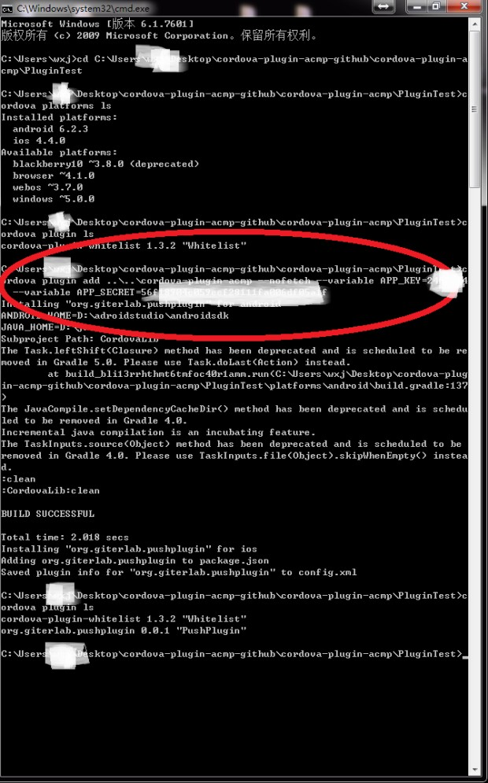
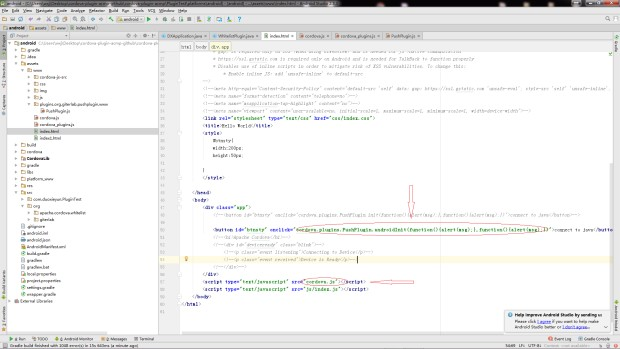
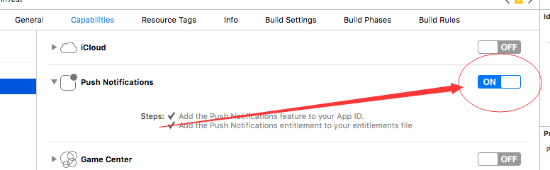
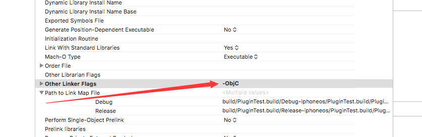

# cordova-plugin-acmp
aliyun acmp for cordova

## 本插件的作用
### cordova-plugin-acmp的主要作用是为了把阿里云移动推送集成到cordova开发中去

## 插件的使用
# 1.cordova开发环境
### cordova安装请参考[cordova安装教程](http://cordova.axuer.com)

# 2.使用步骤

如上图所示，从本地址git clone 项目到本地，也可以直接线上安装
### cordova plugin add <path> --nofetch --variable APP_KEY=*** --variable APP_SECRET=***
使用cordova add plugin命令把plugin安装到项目中，
### cordova plugin ls
使用此命令查看插件装成功与否，如果出现org.giter.pushplugin则表明插件安装成功

# 3.js的调用

 
如上图所示，在项目家在cordova.js的情况先，直接使用cordova.plugins.PushPlugin.androidInit(success,fail)调用

# 4.js接口说明

## <del>1.androidInit(success,fail)</del>
 <del>android系统初始化阿里云推送调用接口，success,fail分别为成功和失败的回调函数</del>
，随着程序的启动自动初始化，取消了本接口
## 2.iosInit(successs,fail)
 iOS系统初始化阿里云推送调用接口，success,fail分别为成功和失败的回调函数
## 3.androidBand(success,fail,args)
 android绑定信息调用接口，success,fail为成功和失败的回调函数
### args格式
 args为参数数组，args[0]表示需要绑定的账号信息，args[1]为需要给账号添加的tags（标签）和alias（别名）组合成json各式数据
例如：**["giterlab","{\"tag_key\":1,\"tag_value\":[\"giter\",\"lab\"],\"alias":\"labgiter\"}"]**

 tag_key 目标类型，1：本设备；2：本设备绑定账号；3：别名

 tag_value 标签（数组输入）

 alias 别名（仅当tag_key = 3时生效）

 其中tag_key,tag_value,alias为json的key，不能更改！！

## 4.iosBand(success,fail,args)

iOS绑定信息调用接口，同上androidBand

# 5.iOS部分项目配置

 
 如上图所示在项目TARGETS中在capabilities中打开Push Notifications

 
### 如上图所示在项目Build Setting中，Other Linker Flags加上-ObjC标签

